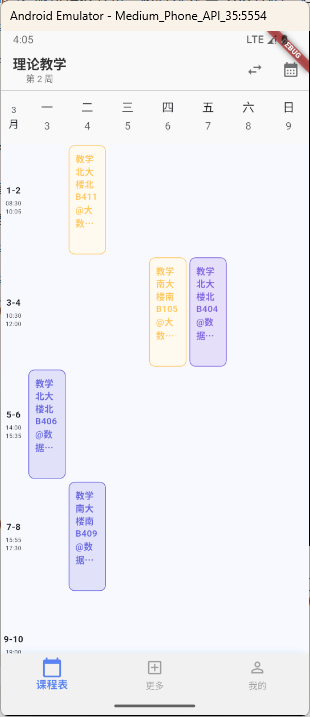

# nit_scholar

掌上南工

## Getting Started

# 更多功能

TODO

# 目前只支持安卓客户端，且短期内不会支持 IOS 客户端。

# 声明

本项目基于[南昌工程学院逆向工程](https://github.com/yowaimono/nit_reverse)构建。

**服务器说明：**

为了支持更多功能（例如：数据聚合、推送通知、更稳定的数据获取等），本项目需要连接到作者建立的服务器才能正常使用。 服务器作为客户端和学校教务系统之间的桥梁，负责处理数据请求和响应。

**隐私声明：**

- **服务器不保存任何用户登录信息（例如：用户名、密码）。** 用户的登录凭据仅用于与学校教务系统进行身份验证，不会被存储在服务器上。
- **服务器不记录任何用户登录日志。** 我们不会跟踪用户的登录时间和 IP 地址等信息。
- **服务器仅存储必要的、经过匿名化处理的、与课表、成绩等相关的数据，用于提供更便捷的服务。** 这些数据不会与用户的个人身份信息直接关联。
- **我们承诺尽最大努力保护用户隐私，并采取必要的安全措施防止数据泄露。**

**免责声明：**

- **本项目为个人开发项目，不保证其长期可用性和稳定性。**
- **本项目作者不对因使用本项目造成的任何直接或间接损失承担任何责任。**
- **请在使用本项目时遵守南昌工程学院的相关规定和法律法规。**
- **如果您对隐私保护有任何疑问或疑虑，请随时联系我们。**

**请仔细阅读并理解以上声明。如果您不同意这些条款，请勿使用本项目。**
